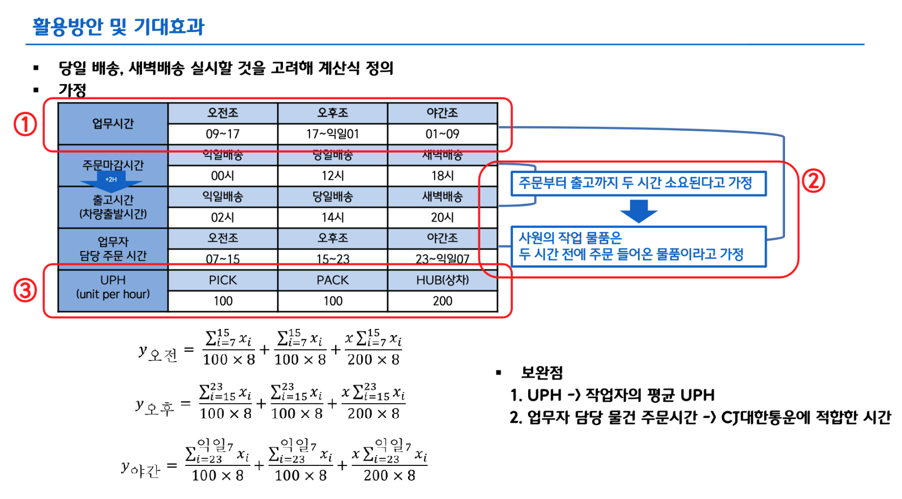

# 시간대별 수요예측을 통한 인력자원관리
### 한 줄 소개
- Machine Learning과 Deep Learning 모델들을 활용해 CJ대한통운 물동량의 시간대별 수요를 예측했으며, 이 결과로 필요한 인력자원 계산식을 정의했다.

<프로젝트 기간 : 2021.09.26 ~ 2021.10.28>  
<tags : EDA, Data Analysis, ML, DL>  
<역할 : EDA, ML Modeling>

- 본 프로젝트는 물류 센터의 시간대별 수요를 최대한 정확히 예측해내어 각 시간대별 인력 자원 관리를 하기 위한 지표로 사용하기 위한 프로젝트이다.

- 우리는 이상치에 영향을 끼치는 최대 고객3사를 데이터 분석을 통해 추정했고, 이들의 예정된 이벤트일들을 반영해 예측의 결과를 더 높일 수 있었다.
  
- 본 프로젝트에서 사용한 수요예측 모델은 ML, 시계열 모델, DL(Seq2Seq, LSTM, GRU)이었다. 이 중 LSTM+GRU 앙상블 모델 성능이 가장 높았다.
  
- 조사한 도메인 지식을 사용해 UPH와 작업 시간대를 가정하고, 각 시간대에 예측된 수요를 맞추기 위한 최적의 인력 자원 수를 계산하는 수식을 아래와 같이 만들었다.
  
- 여기서 UPH란 작업자의 시간당 생산량을 의미한다.

  

