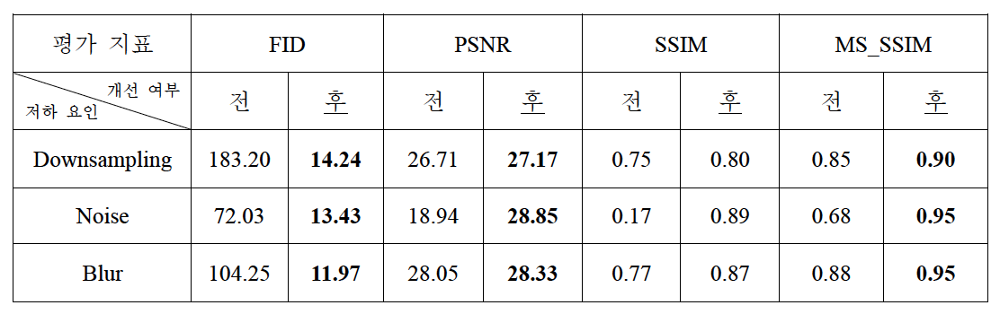
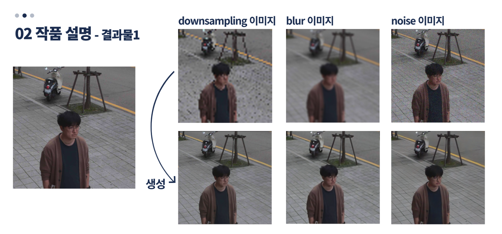
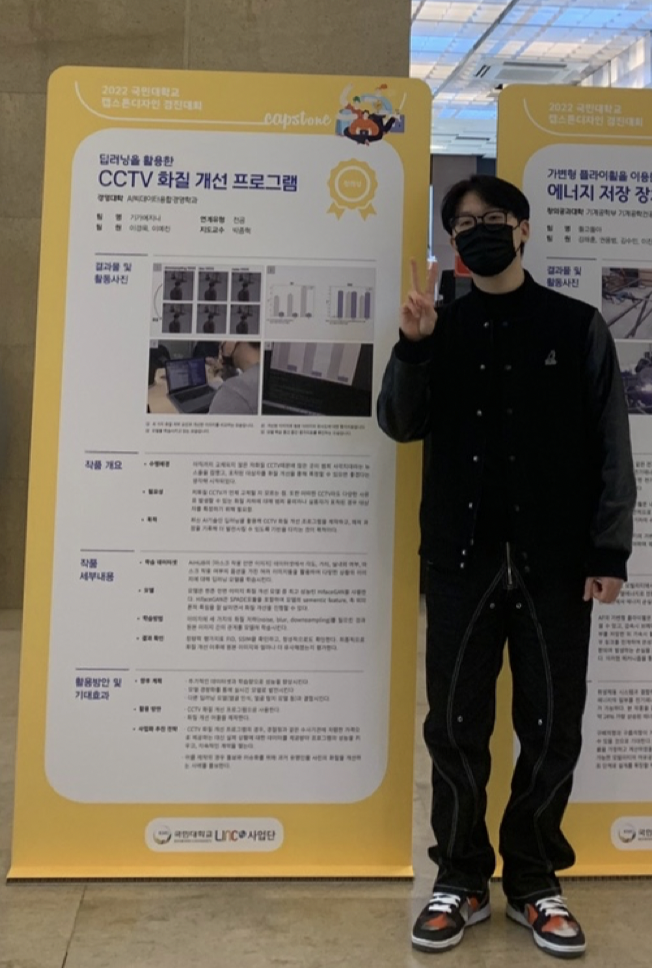

### 발표영상 -> [링크](https://www.youtube.com/watch?v=YDaXfIfclkY&t=164s)

# 딥러닝을 활용한 CCTV 화질개선 프로그램
### 한 줄 소개
- 다양한 환경에서 저화질 안면 이미지들의 화질을 딥러닝 모델을 통해 개선시키고 이를 평가했다.

<프로젝트 기간 : 2022.11.26 ~ 2022.12.7>    
<Tags : DeepLearning, CV, Super-resolution>   
<역할 : 팀장, Modeling, presentation>

- 본 프로젝트는 CCTV를 가정한 다양한 환경의 안면 이미지 데이터셋에 downsampling, blur, noise 라는 세 가지 화질 저하를 일으킨 후, 안면 이미지 초해상화 SOTA 모델인 HifaceGAN을 사용하여 화질을 개선한 프로젝트이다.

- Chan Liu et. al (2021)의 HifaceGAN이 Teasung Park et. al (2019)의 SPADE 메커니즘을 통해 이미지의 의미론적 정보를 활용하여 안면 이미지 화질 개선분야에서 SOTA를 달성했다. HifaceGAN은 다른 정보없이 이미지만을 사용하고, noise와 blur같이 다양한 화질 저하 요인에 대한 개선 성능이 입증되었고 안면이 아닌 일반 이미지에 대한 화질 개선 성능 또한 입증되어 배경의 비중이 클 수 있는 실제 상황의 안면 이미지에 대한 화질 개선 알고리즘으로 적합하다.

- 실제 상황에서의 안면 이미지 데이터셋을 사용하기 위해 AIHUB의 <한국인 마스크 착용 안면 이미지> 데이터셋을 사용했다. 해당 데이터셋은 한 사람에 대해 거리, 각도, 마스크 착용 여부, 마스크 색상, 실/내외 여부에 따라 32가지 옵션을 가지고 있고, 마스크의 착용 여부와 색상은 실제 상황에 적합하도록 랜덤하게 샘플링을 진행했다.
  
- 화질 개선 결과 원본과의 이미지 유사도로 측정한 평가지표는 <표 1>과 같으며, 정성적인 평가를 위해 제시하는 화질 개선 이미지 사례는 <그림 1>과 같다.
  

<표 1>

<그림1>

## 수상작 결과물 전시

